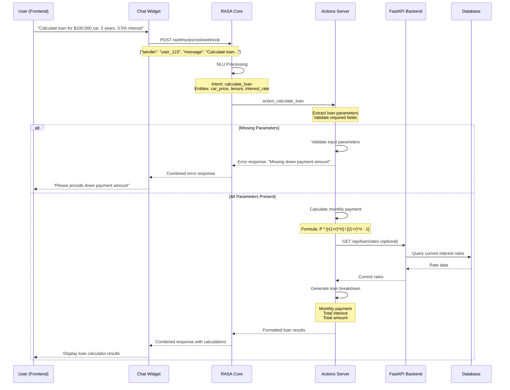
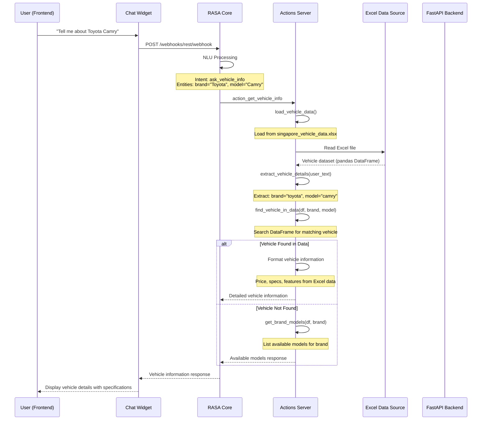
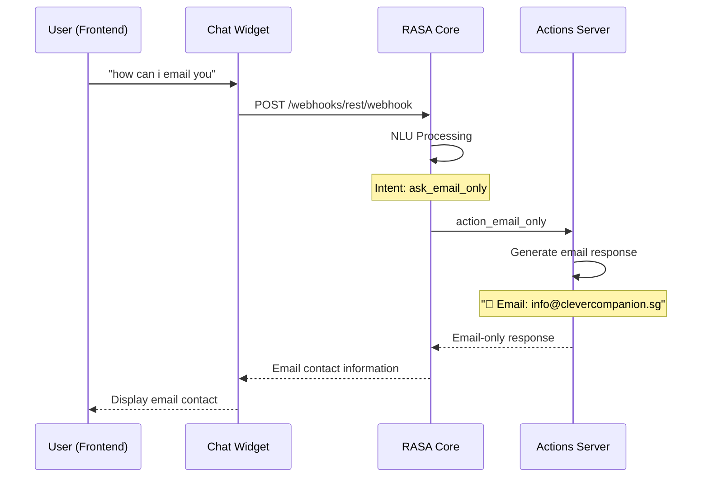
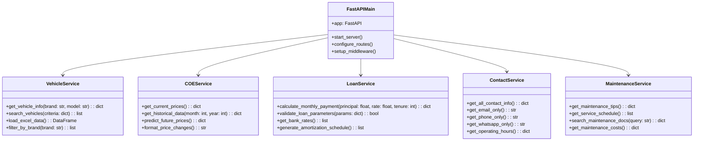
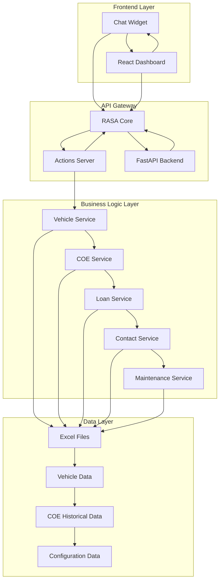
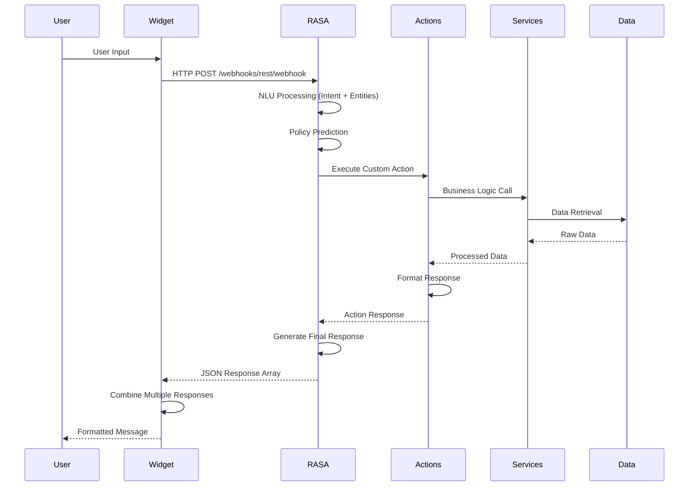
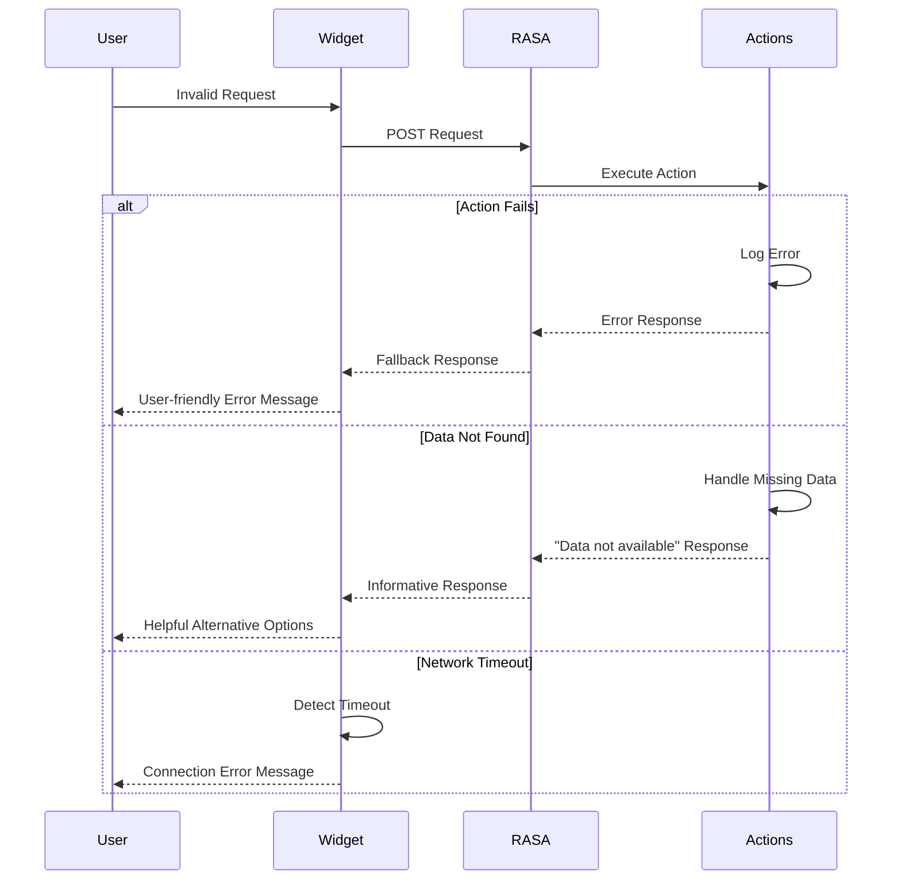

# Backend Architecture Documentation

## Sequence Diagrams and Class Diagrams

### Problem 6 Solution: Complete Backend Architecture Documentation

## 1. User Story: Calculate Monthly Installment

**User Story:** As a user, I want to calculate my monthly installment for a car loan.

### Sequence Diagram: Monthly Installment Calculation

## 2. User Story: Get Vehicle Information

**User Story:** As a user, I want to get information about a specific vehicle model.

### Sequence Diagram: Vehicle Information Retrieval with RAG

## 3. User Story: Get Contact Information

**User Story:** As a user, I want to get contact information (email only).

### Sequence Diagram: Contact Information

## 4. Class Diagram: Backend Architecture

### FastAPI Backend Structure (Post-BCE Removal)

## 5. RASA Actions Class Structure

```mermaid
classDiagram
    class ActionBase {
        <<abstract>>
        +name(): str
        +run(dispatcher, tracker, domain): list
        +extract_entities(tracker): dict
    }
    
    class ActionCOEPrices {
        +name(): str = "action_coe_prices"
        +run(): list
        +extract_coe_query_details(text: str): dict
        +format_change(change: int): str
    }
    
    class ActionCalculateLoan {
        +name(): str = "action_calculate_loan"
        +run(): list
        +extract_loan_details(text: str): dict
        +calculate_loan_payment(): dict
        +validate_parameters(): bool
    }
    
    class ActionGetVehicleInfo {
        +name(): str = "action_get_vehicle_info"
        +run(): list
        +load_vehicle_data(): DataFrame
        +extract_vehicle_details(text: str): tuple
        +find_vehicle_in_data(): dict
        +get_brand_models(): str
    }
    
    class ActionOperatingHours {
        +name(): str = "action_operating_hours"
        +run(): list
        +check_specific_day(text: str): dict
        +check_holiday_query(text: str): bool
        +get_full_schedule(): str
    }
    
    class ActionContactInfo {
        +name(): str = "action_contact_info"
        +run(): list
    }
    
    class ActionEmailOnly {
        +name(): str = "action_email_only"
        +run(): list
    }
    
    class ActionPhoneOnly {
        +name(): str = "action_phone_only"
        +run(): list
    }
    
    class ActionWhatsAppOnly {
        +name(): str = "action_whatsapp_only"
        +run(): list
    }
    
    class ActionRecommendEconomicCars {
        +name(): str = "action_recommend_economic_cars"
        +run(): list
        +get_economic_models(): list
        +format_recommendations(): str
    }
    
    ActionBase <|-- ActionCOEPrices
    ActionBase <|-- ActionCalculateLoan
    ActionBase <|-- ActionGetVehicleInfo
    ActionBase <|-- ActionOperatingHours
    ActionBase <|-- ActionContactInfo
    ActionBase <|-- ActionEmailOnly
    ActionBase <|-- ActionPhoneOnly
    ActionBase <|-- ActionWhatsAppOnly
    ActionBase <|-- ActionRecommendEconomicCars
```

## 6. Data Flow Architecture

### Overall System Architecture

## 7. Request/Response Flow

### Complete Request Processing Flow

## 8. Error Handling Flow

This documentation covers the complete backend architecture with proper FastAPI structure (removing BCE), comprehensive sequence diagrams for user stories, class diagrams for all major components, and detailed data flow documentation. 